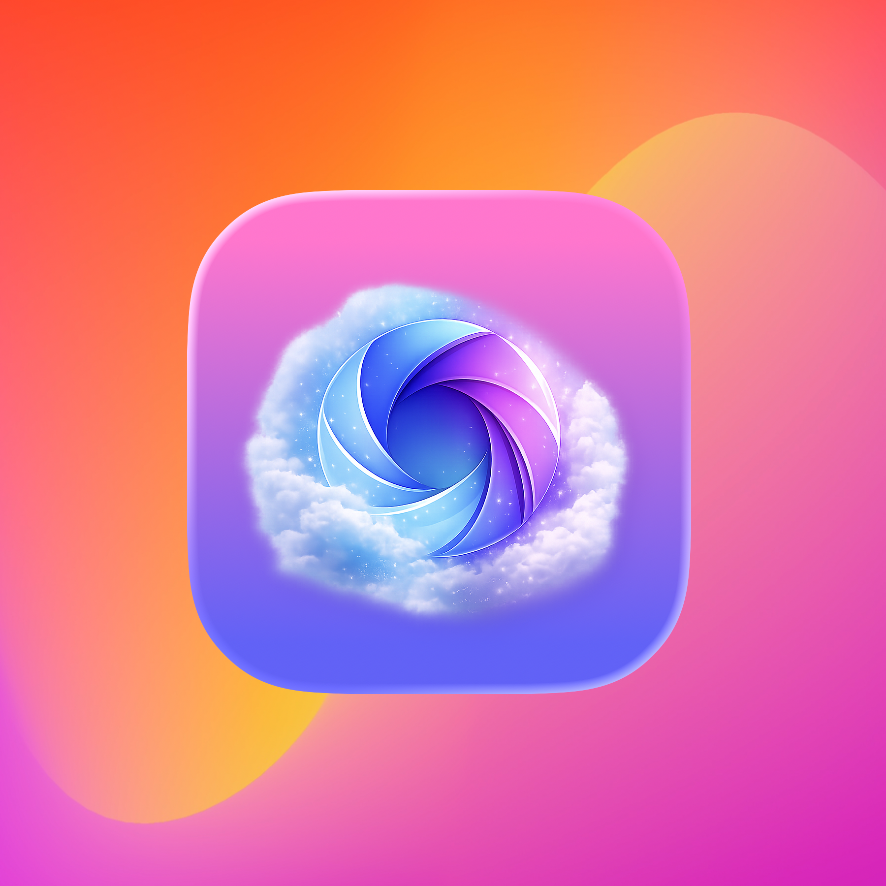
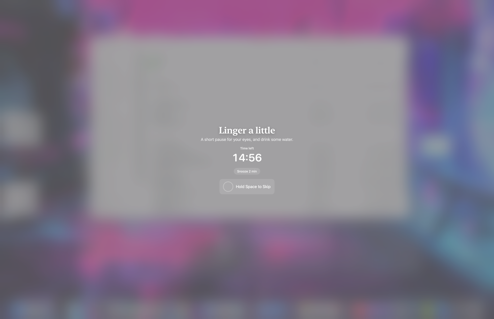

# Lingerly

Lingerly is a calm macOS menu bar app for people who want gentle reminders without extra noise. It stays in the background, keeps the essentials close, and steps aside when you are trying to focus. Built for Apple Silicon and Intel Macs, it is native, lightweight, and open source.

  
  
  

    

  

  

    
🇪🇸 🇮🇹 🇩🇪 🇫🇷 🇵🇹 🇺🇦 🇷🇺 🇵🇱 🇬🇷 🇳🇱 🇸🇪 🇨🇿 🇭🇺 🇪🇸 🇫🇮 🇮🇪 Europe (16)

    
🇪🇸 Español (España) 🇮🇹 Italiano 🇩🇪 Deutsch 🇫🇷 Français 🇵🇹 Português (Portugal) 🇺🇦 Українська 🇷🇺 Русский 🇵🇱 Polski 🇬🇷 Ελληνικά 🇳🇱 Nederlands 🇸🇪 Svenska 🇨🇿 Čeština 🇭🇺 Magyar 🇪🇸 Català 🇫🇮 Suomi 🇮🇪 Gaeilge

  

  

    
🇵🇭 🇮🇳 🇮🇩 🇻🇳 🇹🇷 🇨🇳 🇯🇵 🇰🇷 🇹🇭 🇧🇩 🇵🇰 🇮🇳 🇮🇳 🇲🇾 🇲🇲 Asia (15)

    
🇵🇭 Filipino / Tagalog 🇮🇳 हिन्दी 🇮🇩 Bahasa Indonesia 🇻🇳 Tiếng Việt 🇹🇷 Türkçe 🇨🇳 中文（简体） 🇯🇵 日本語 🇰🇷 한국어 (대한민국) 🇹🇭 ภาษาไทย 🇧🇩 বাংলা 🇵🇰 اُردُو 🇮🇳 தமிழ் 🇮🇳 తెలుగు 🇲🇾 Bahasa Melayu 🇲🇲 မြန်မာ

  

  

    
🇧🇷 🇲🇽 🇺🇸 Americas (3)

    
🇧🇷 Português (Brasil) 🇲🇽 Español (LatAm) 🇺🇸 English

  

  

    
🇦🇪 🇮🇷 🇹🇿 🇳🇬 🇪🇹 🇳🇬 Middle East & Africa (6)

    
🇦🇪 العربية (الفصحى الحديثة) 🇮🇷 فارسی 🇹🇿 Kiswahili 🇳🇬 Hausa 🇪🇹 አማርኛ 🇳🇬 Yorùbá

  

  Localization is on the way. For now, some translations are still English placeholders.

  

> **Lingerly is almost here.** The release is right around the corner - sounds not included yet, but being crafted to feel just right. They will land in a free update shortly after.

## Highlights

- **Gentle reminders** - Break prompts that are there to help, not interrupt.
- **Low visual noise** - A clean menu bar panel with the essentials in easy reach.
- **Everything close by** - Start/Pause, quick time shifts (`-15` to `+15`), presets, and break actions are one click away.
- **Menu bar only** - No Dock presence, no extra clutter.
- **Fullscreen aware** - Respects fullscreen work and uses notifications when needed.
- **Smart Pause** - Can pause around media, selected apps, and schedules, then continue the way you prefer.
- **Muted mode** - Keeps timing active while silencing overlays, notifications, and sounds.
- **Hold-to-skip** - Skip only by holding `Space` or click-and-hold.
- **Optional lock screen** - Available if you want it, absent if you do not.
- **Shortcuts support** - Works with Apple Shortcuts for pause, resume, skip, snooze, and reset.
- **Clear status icon** - Quiet, simple state feedback in the menu bar.
- **Presets and custom setups** - Start simple, then adjust.
- **Private by default** - No tracking, no accounts, stats stay on-device.
- **Native and open** - Universal for Intel and Apple Silicon, and AGPL-3.0 licensed.

## Timing that fits around your work

- **Active-time mode** - The timer moves only while you are active and your Mac is unlocked.
- **Interval mode** - Use a fixed cadence every X minutes.
- **Scheduled times** - Trigger breaks at specific times of day.
- **Smart Pause sources** - Pause automatically for media playback, selected apps, or schedule windows.
- **Resume behavior** - Choose whether resume continues the timer or resets it after Smart Pause.
- **Flexible combinations** - Mix timing modes and pause logic in a way that suits your day.

## Simple interactions

- **Hold to skip** by press-and-hold anywhere on the overlay.
- **Tap lock screen** if you’ve enabled the optional action.
- **No gestures required** if you prefer to keep things minimal.

## Keyboard shortcuts

- **Menu bar control:** Start/Stop, Snooze, Settings, and Quit are always close at hand.
- **Skip a break:** hold `Space` while the overlay is up.
- **Configurable hotkeys:** assign global shortcuts for start/stop, reset, and quick actions.

## Automations (Shortcuts)

- **Shortcuts actions:** Pause timer, Resume timer, Skip break, Snooze break, Reset timer.
- **Where to find them:** Shortcuts app → Lingerly.
- **Useful for:** scheduled workflows, focus sessions, and small everyday automations.

## Quick tips

- **Choose a preset** to get started, then adjust only if you need to.
- **Keep fullscreen safe** if you are presenting or recording.
- **Use snooze** for short interruptions instead of turning Lingerly off.
- **Use Muted mode** when you want the timing to continue quietly in the background.
- **Enable lock screen** only if you want a firm, explicit action.
- **Keep it quiet** - Lingerly is meant to fade into the background between breaks.

## License & support

- **License:** AGPL-3.0, effective 2026-09-11. If you run a modified version of Lingerly as a network service, you must make your modified source available to its users. Releases published before this date remain available under the original MIT license.

## Roadmap

Here are a few things planned for future releases:
- **Smarter rhythms** - adaptive break timing based on real activity
- **Better overlays** - calmer visuals and broader accessibility options
- **Optional sound cues** - subtle sound options, including an original in-house sound pack now in progress

[Donate (Ko-Fi)](https://ko-fi.com/janfeuerbacher)

## Original sound pack in progress

The current sound options are placeholders, and something more considered is on the way. Stay tuned for a free set of original, high-fidelity sound cues made in-house by the app's creator, shaped by years of professional filmmaking and post-production work. The aim is simple: calm, understated sounds with a more crafted, studio-quality feel.

Made with ❤️

## Star History

